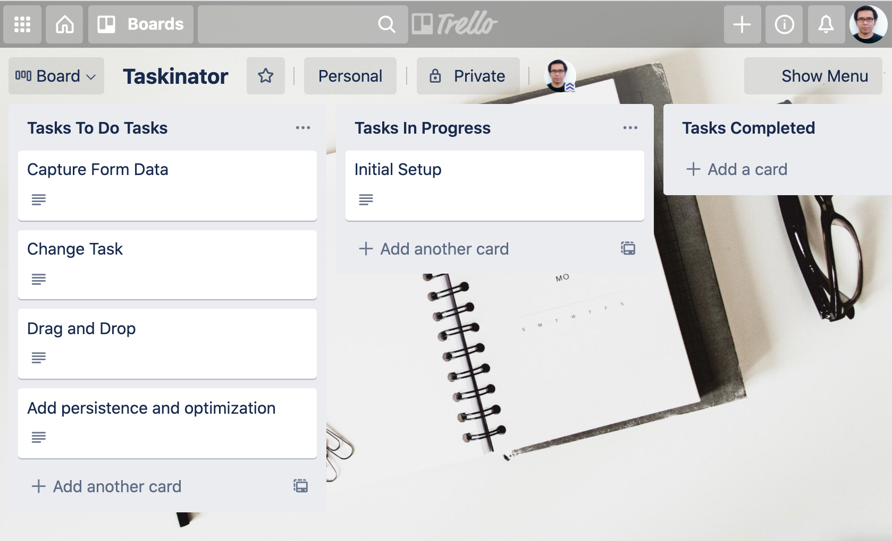

Taskinator
===
Assigned to Weng Fei Fung. App that lets you create a todo list, add notes on the tasks, and quickly visualize which tasks are being worked on or completed.

Live Demo
---
Visit the [todo-task app](http://siphon880gh.github.io/ucla-taskinator)

Trello as a model
---
While working on the code, I am using [Trello](https://www.trello.com) as a model. Tasks are created and dragged to different columns based on it being worked on or completed. Clicking a task shows more details on how the task can be done.

